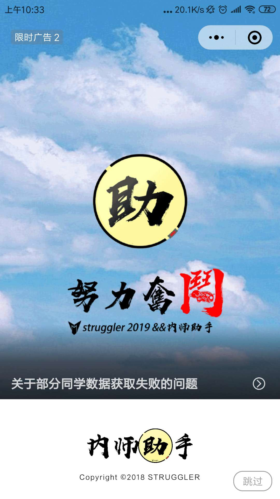
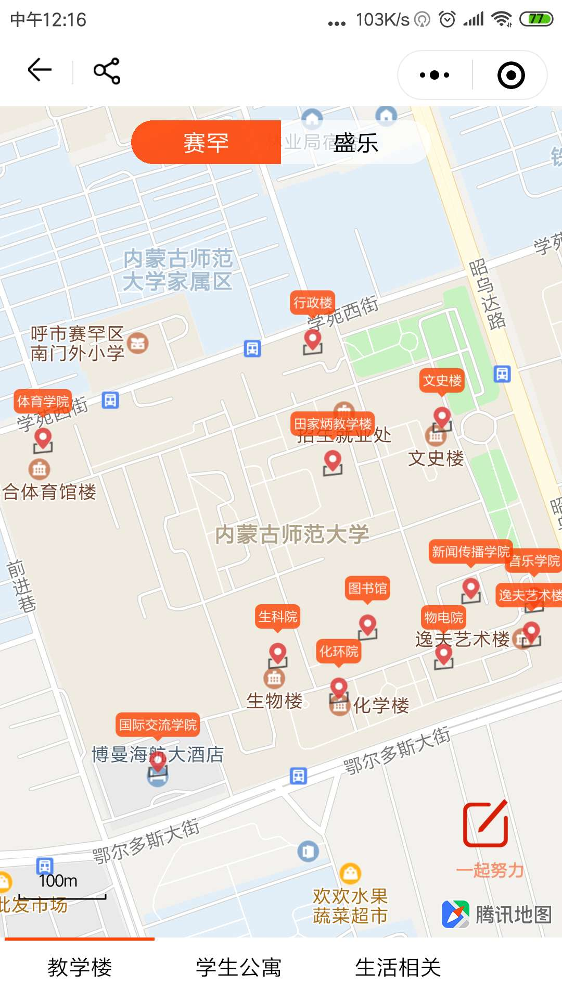

# 内师助手  微信小程序（mini programs）


[](https://github.com/strugglerx/gpaCalculator/blob/master/LICENSE)

*last update(2019/01/31)*

>*整理并完成说明文档*


## 简介
>  内师助手是一款诞生于 2018/06 月的微信小程序,自项目上线以来,开发者不断更新迭代, 截止 11 月,小程序更新次数高达五十次,深受大家的喜欢。
小程序的受众用户主要是内蒙古师范大学的本科生,年龄区间在 18-24 岁之间,目前累计
用户 1.6w,月活 7k,日活 2.6k 左右。

> 二次说明：本项目是我从零开始断断续续写出来的，部分代码参考了别人的开源项目，已严格遵循MIT开源协议，代码的质量不高，开源的目的仅仅只是为了给大家一个参考。

>  相关文章在此：[谈谈我为什么要创造内师助手？以及对一些事的看法](https://mp.weixin.qq.com/s?__biz=MjM5NTk0MjYyMA==&mid=2651014094&idx=1&sn=c88613e284ddaeb7aa8b4af553387bc9&chksm=bd073a7d8a70b36b4f6553ad3e9ab9799955e3f507914bfeb08ecc547afc7165800f2c00dec5&token=230111624&lang=zh_CN#rd)

> 开源的目的是,我即将步入社会大学,人的精力总是有限的,如果有一天我没有精力维护这个项目,我期待这个时候有一个人可以挺身而出,继续维护这个项目,造福更多19级,20级,甚至xx级的学弟学妹们


## 开发工具

>微信web开发工具


## 页面路径

app.json

``` javascript
  "pages": [
    "pages/index/index", //首页
    "pages/more/more", 
    "pages/more/binding", 
    "pages/more/ad",  
    "pages/more/user/user",
    "pages/more/about/about", //关于
    "pages/more/about/donate",
    "pages/more/about/opensource",
    "pages/tools/calendar/calendar", //校历
    "pages/tools/physical/physical", //体测
    "pages/tools/library/library", //图书馆
    "pages/tools/library/query", 
    "pages/tools/score/score", //成绩
    "pages/tools/run/run", //运动排行
    "pages/tools/gpa/gpa", //gpa计算
    "pages/tools/middle/middle", 
    "pages/tools/schedule/schedule", //校车时刻表
    "pages/tools/article/article", 
    "pages/tools/class/class", //课表
    "pages/tools/map/map", //地图
    "pages/tools/map/mapform",
    "pages/tools/jobs/article",
    "pages/tools/jobs/jobs", //招聘信息流
    "pages/tools/avatar/avatar"  
  ],
```

## 页面截图
<div align="center">
    
    
    
    
</div>


## 怎么体验内师助手?


盘它!


## 联系方式

公众号：STRUGGLER[[wx-struggler](https://mp.weixin.qq.com/s/KOydGJa7D3dJzl9fvOUTQg)]

微信：`strongdreams`

邮箱： `str@li.com`


##### ~~更多待补充中~~


## 开源协议

[MIT Copyright (c) 2018 STRUGGLER](https://github.com/strugglerx/nsEngine/blob/master/LICENSE)
